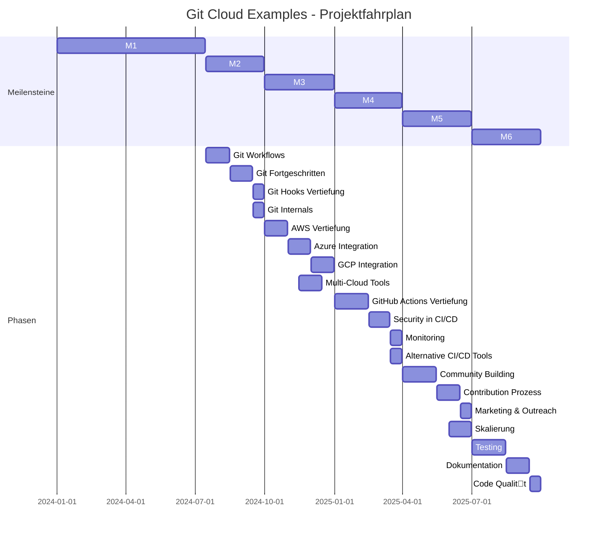
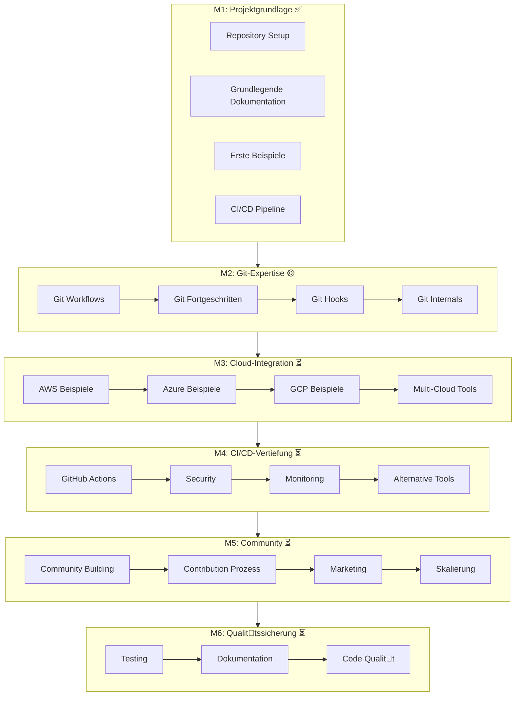
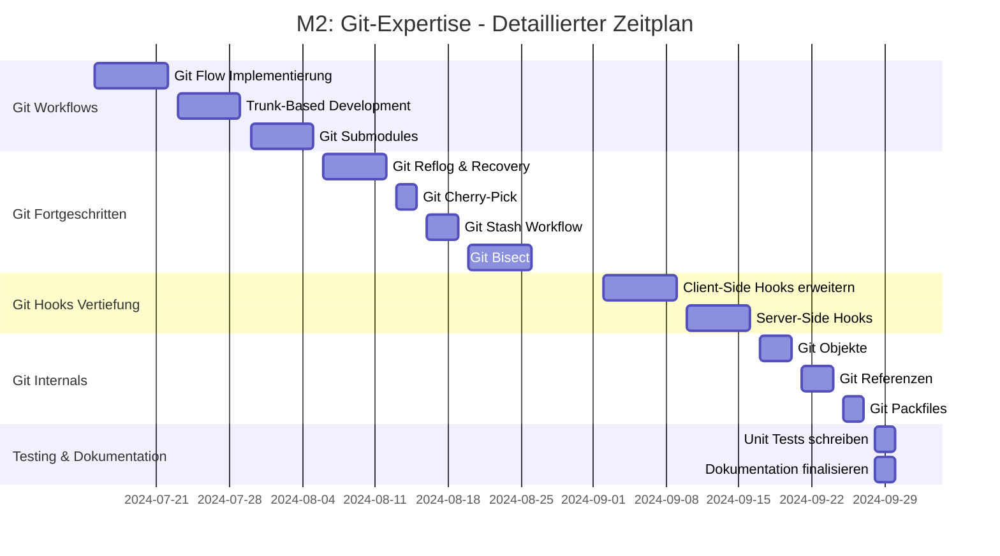
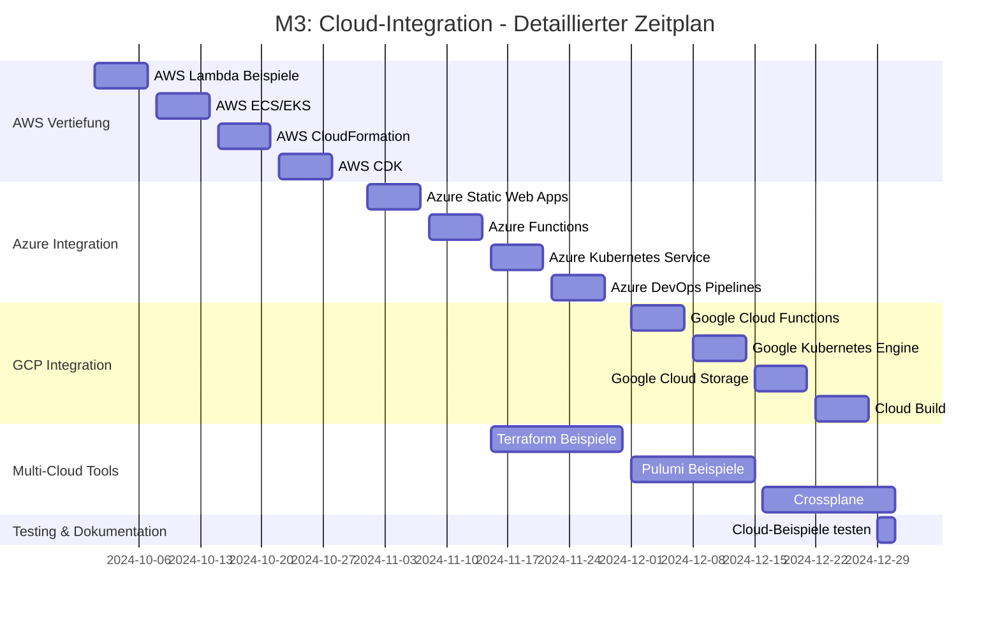
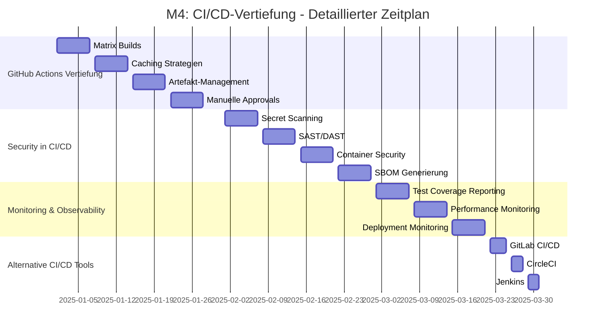
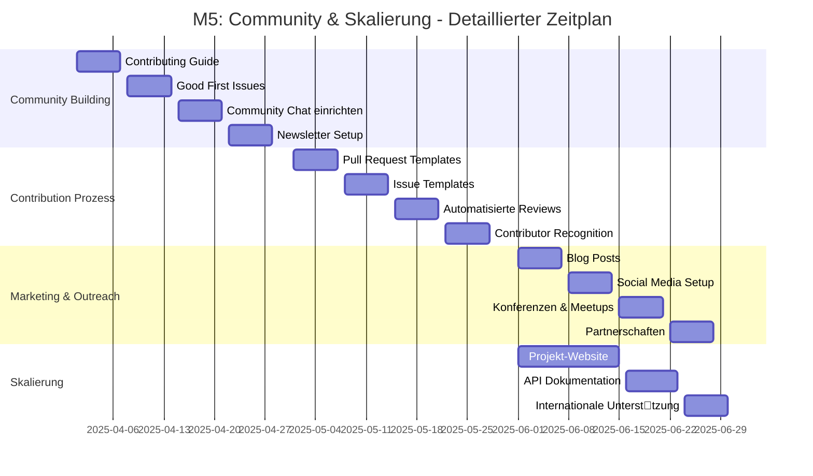
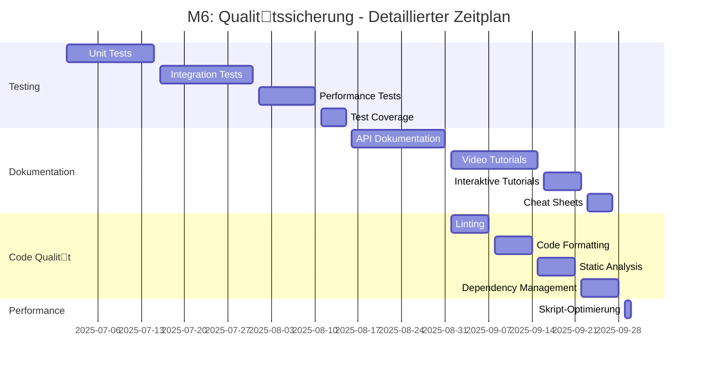

# Projektfahrplan: Visuelle Timeline

> **Mermaid-Diagramme** für eine übersichtliche Darstellung des Projektfahrplans.
> 
Hinweis: Diese Diagramme können direkt in GitHub, VS Code (mit Mermaid-Plugin) oder [Mermaid Live Editor](https://mermaid.live/) angezeigt werden.

---

## 📅 Gesamtübersicht (Gantt-Chart)



---

## 🎯 Meilenstein-Dependencies



---

## 📊 Erfolgsmetriken Timeline

```mermaid
lineChart
    title Git Cloud Examples - Wachstumsprognose
    xAxisType time
    xFormat YYYY-MM
    yAxisType linear
    
    line Beispiele, #0077b6, 2024-07,8,2024-09,20,2024-12,45,2025-03,65,2025-06,70,2025-09,75
    line Dokumentation, #00b4d8, 2024-07,3,2024-09,8,2024-12,15,2025-03,20,2025-06,25,2025-09,30
    line Stars, #90e0ef, 2024-07,10,2024-09,50,2024-12,100,2025-03,200,2025-06,500,2025-09,1000
    line Contributors, #caf0f8, 2024-07,1,2024-09,2,2024-12,5,2025-03,8,2025-06,12,2025-09,15
```

---

## 🏗️ M2: Git-Expertise - Detaillierte Timeline



---

## ☁️ M3: Cloud-Integration - Detaillierte Timeline



---

## 🔄 M4: CI/CD-Vertiefung - Detaillierte Timeline



---

## 👥 M5: Community & Skalierung - Detaillierte Timeline



---

## ✅ M6: Qualittssicherung - Detaillierte Timeline



---

## 📈 Risikoanalyse als Diagramm

```mermaid
quadrantChart
    title Risikoanalyse - Git Cloud Examples
    x-axis "Eintrittswahrscheinlichkeit" --> "Niedrig" --> "Hoch"
    y-axis "Auswirkung" --> "Niedrig" --> "Hoch"
    
    quadrant-1 "Hohe Prioritt"
        "Cloud-Kosten explodieren": [0.5, 0.8]
        "Zu wenige Contributor:innen": [0.5, 0.8]
        "Projekt verliert Momentum": [0.5, 0.8]
    
    quadrant-2 "Beobachten"
        "Beispiele veraltet": [0.7, 0.5]
        "Kommunikationsprobleme": [0.7, 0.5]
        "Priorittenkonflikte": [0.7, 0.5]
    
    quadrant-3 "Akzeptieren"
        "Wettbewerbsprojekte": [0.5, 0.3]
    
    quadrant-4 "Vorbereiten"
        "Cloud-Anbieter ndert API": [0.2, 0.5]
        "GitHub ndert Features": [0.2, 0.5]
        "Sicherheitslcken in Beispielen": [0.2, 0.8]
        "Abhngigkeiten nicht verfgbar": [0.2, 0.5]
```

---

## 🎨 Farblegende

| Farbe | Bedeutung |
|-------|-----------|
| 
🟢 Grün | Abgeschlossen |
| 
🟡 Gelb | In Arbeit |
| 
🔵 Blau | Geplant |
| 
⚪ Weiß | Nicht gestartet |

---

## 📚 Wie du die Diagramme nutzt

### In GitHub
1. Öffne diese Datei in GitHub
2. Die Mermaid-Diagramme werden automatisch gerendert
3. Klicke auf die Diagramme, um sie zu vergrößern

### In VS Code
1. Installiere die [Mermaid-Extension](https://marketplace.visualstudio.com/items?itemName=bierner.markdown-mermaid)
2. Öffne diese Datei
3. Die Diagramme werden direkt in der Vorschau angezeigt

### Im Mermaid Live Editor
1. Kopiere den Mermaid-Code
2. Gehe zu [https://mermaid.live/](https://mermaid.live/)
3. Füge den Code ein und sieh das Diagramm

---

## 🔗 Nützliche Links

- [Vollständiger Projektfahrplan](PROJEKTFAHRPLAN.md)
- [Zusammenfassung](PROJEKTFAHRPLAN_ZUSAMMENFASSUNG.md)
- [Repository auf GitHub](https://github.com/JoeDus-prog/git-cloud-examples)
- [Mermaid Dokumentation](https://mermaid.js.org/)
- [Mermaid Live Editor](https://mermaid.live/)

---

*Dokument generiert am 2024-07-14 | 
Letzte Aktualisierung: 2024-07-14*
